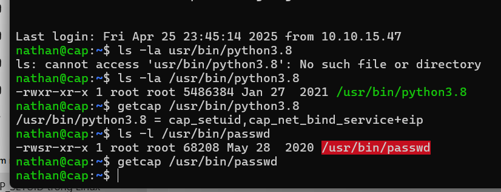

-  `suid` -> khi chạy thì có luôn quyền của người sở hữu file đó -> khi chạy file chạy dưới quyền người sở hữu.
- `cap_suid` -> khi chạy đến lệnh thay đổi uid, nó mới cấp quyền chạy lệnh đó.
- Muốn xem một file có quyền chạy `set_uid` không thì dùng lệnh sau:
    ```bash
    getcap <path-to-file>
    ```
    